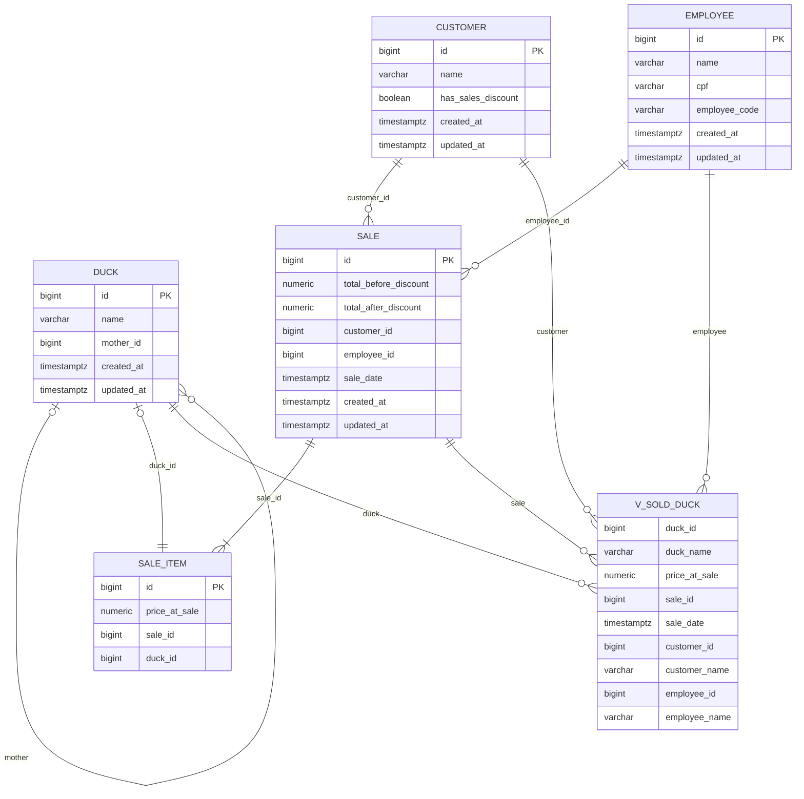

# 🚀 README

Aplicação **Spring Boot** desenvolvida com **Java 21 (Eclipse Temurin)**.

## Pré-requisitos
**Java 21**

Baixe e instale o Java 21. Se quiser orientação sobre qual distribuição escolher e como instalar, visite **[whichjdk.com](https://whichjdk.com/)**.

  > Este projeto foi desenvolvido e testado usando **Eclipse Temurin 21**.

**Docker** e **Docker Compose**

Necessários para construir a imagem e subir os serviços. Certifique-se de que o Docker esteja em execução.

**Maven**

Normalmente não é necessário instalar o maven manualmente, pois o projeto inclui o **Maven Wrapper** (`mvnw` / `mvnw.cmd`).

Somente se o wrapper não estiver disponível no seu ambiente, instale o Maven (3.9+).

---

## Clonar o projeto

```bash
git clone git@github.com:FMABr/ducks_demo.git
cd ducks_demo
```

---

## Build da imagem Docker com Spring Boot

Use o **Maven Wrapper** a partir da raiz do projeto:

**Linux/macOS:**

```bash
./mvnw -DskipTests spring-boot:build-image -Dspring-boot.build-image.ducks_app=preco_justo/ducks:1.0.0
```

**Windows:**

```bat
mvnw.cmd -DskipTests spring-boot:build-image -Dspring-boot.build-image.ducks_app=preco_justo/ducks:1.0.0
```

---

## Subir a aplicação

Após a imagem estar disponível localmente:

```bash
docker compose -f full_compose.yaml up
```

* Para rodar em segundo plano:

  ```bash
  docker compose -f full_compose.yaml up -d
  ```
* Para encerrar:

  ```bash
  docker compose -f full_compose.yaml down
  ```

> As portas/variáveis de ambiente expostas são definidas no `full_compose.yaml`.

---

## Cronograma de desenvolvimento

### Configuração inicial e infraestrutura (2h)
- Iniciar projeto Spring Boot através do spring initializr.
- Iniciar uma instância do Postgres com Docker.
- Configurar `application.properties`.

### Modelagem de domínio e banco (2h)
- Definir entidades e relacionamentos.
- Criar constraints e indices.
- Migração inicial com Flyway.

### Entidades, repositórios e mapeamentos (2h)
- Implementar entidades JPA e repositórios.
- Adicionar anotações de validação.

### Endpoints de Patos (2h)
- CRUD.
- Endpoint de patos vendidos.
- Preço computado pela quantidade de filhos.

### CRUD de Clientes (1h)
- CRUD.

### CRUD de Funcionários (1h)
- CRUD.
- Impedir exclusão se possuir vendas.

### Criar e Ler Vendas (3h)
- Impedir revenda.
- Lógica de desconto por cliente.

### Rankings de Funcionários (2h)
- Ranking de funcionários por quantidade de vendas
- Ranking de funcionários por receita.

### Geração de relatório em excel (2h)
- Adicionar e configurar o Apache POI como dependência.
- Preparar consulta dos dados do relatório.
- Lógica de aninhar patos filhos abaixo da mãe. 

### Containerização (2h)
- Plugin do Spring Boot para geração da imagem.
- Compose-file para execução do app e banco de dados.

---

## Modelagem do banco
